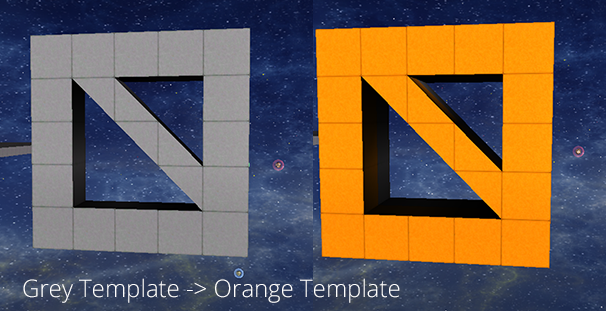

# Getting Started

Starmadepy is a Python library for manipulating Starmade game data. If you've arrived at this page looking for a way of editing Starmade Templates or Starmade Blueprints non-programmatically then you should check out some other projects.

- - -

Installation
---------------
This guide recommends you use virtualenvwrapper or virtualenv.

    pip install starmadepy

That's it! On to the next bit.

- - -

Color Changer - Your First Starmadepy Project
--------------
In this project we're going to load in a template file and change all the colors from grey to orange. That means grey hull, wedges, corners, tetras, and pentas of all armor levels (basic, standard, advanced, and crystal) will be modified to their orange equivalents.

Using the Template class from the starmade module we can load a .smtpl file. The Template class provides many methods for easily modifying its contents. For this particular example we'll be using the replace method, which takes a source query, and output transform. That means it will select all the blocks in the current template that match the source query, and then modify them with the transformations in the output transform. Finally, we can save the current state of the Template, modifications and all, with the save method.

    from starmadepy import starmade

    template = starmade.Template.fromSMTPL('sometemplatefile.smtpl')
    template.replace({'color': 'grey'}, {'color': 'orange'})
    template.save('outtemplatefile.smtpl')

If everything went correctly, you should now have a second template file with orange blocks where the grey ones were (like the following image)

